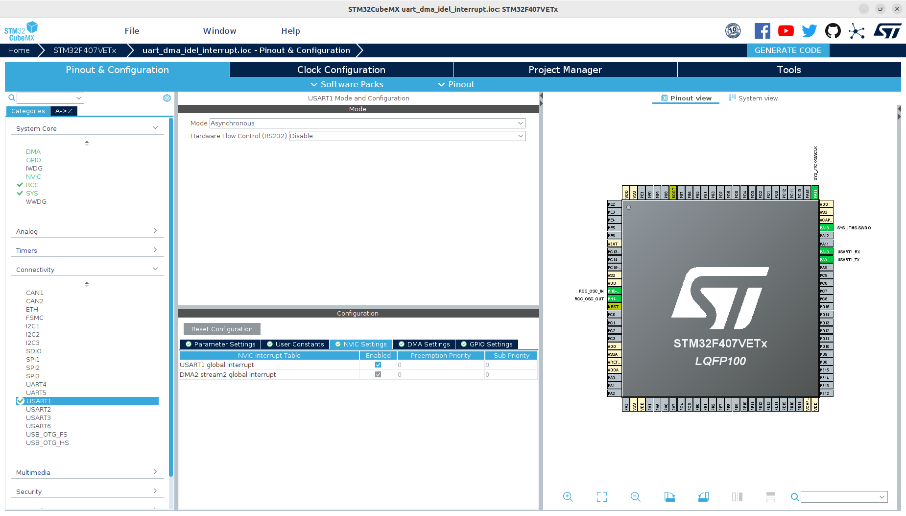
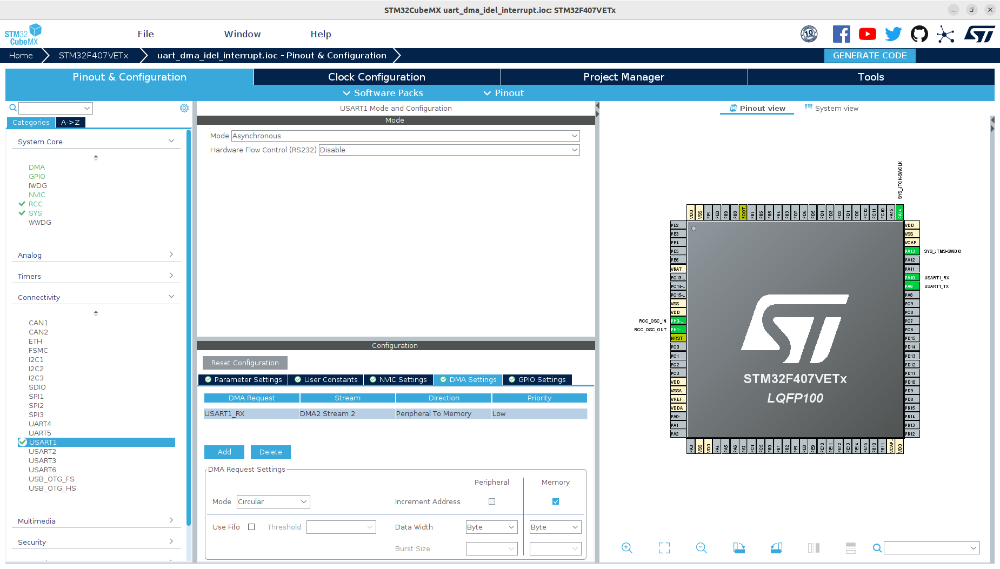

# 这是一个通过STM32CubeMX创建的串口空闲中断+dma工程
## 工程概述
串口配置成空闲中断模式，并开启DMA模式，当收到数据后，通过DMA保存到缓存buffer，当本次数据接收完成后，进入空闲中断，中断服务程序处理本次收到的所有数据

## 1、创建过程
省略了基本配置，只展示串口中断和MDA相关配置

### 1.1、串口中断配置
+ 在Pinout&Configuration->Connectivity选择USART1，NVIC Setting->USART1 global interrupt->Enabled勾选

- 其它设置默认，一般不用修改

### 1.2、串口DMA配置
+ DMA Setting点击Add，选择USART1_RX，Mode选择Circular，其它保持默认


### 1.3、生成工程代码
- 点击GENERATE CODE，等待生成工程

## 2、代码分析

### 2.1、功能设计思路
+ 由于使用stm32CubMX配置串口DMA后，会默认开启DMA中断，这个中断是在串口接收一定长度的数据后触发的，并不是我们想要的空闲中断，所以需要手动关闭DMA中断
+ 然后使用HAL库函数HAL_UARTEx_ReceiveToIdle_DMA启动串口空闲DMA中断
+ 最后，未来保证每次空闲中断后，DMA缓存数据buffer（即HAL_UARTEx_ReceiveToIdle_DMA函数的第二个参数指向的buffer）都会清空，方便下次保存数据，故每次中断后，都重新开启串口DMA空闲中断

### 2.2、变量定义
```
...
/* USER CODE BEGIN PD */
#define RX_MAX_LENGTH (500)
/* USER CODE END PD */
...
/* USER CODE BEGIN PV */
uint8_t receive_buffer_[RX_MAX_LENGTH];
uint32_t rx_count_ = 0;

uint8_t whole_msg_[RX_MAX_LENGTH];
/* USER CODE END PV */
```
- RX_MAX_LENGTH：保存数据的buffer长度
- receive_buffer_：DMA缓存数据的地址，暂时保存本次串口数据
- rx_count_：接收了多少位数据，注意，这个编译定义时，其类型要满足最大值RX_MAX_LENGTH，比如RX_MAX_LENGTH定义为500，则rx_count_不能是uint8_t类型，否则会溢出
- whole_msg_：当触发串口空闲中断后，把本次接收数据全部从receive_buffer_拷贝到该变量中，在外边进行处理

### 2.2、关闭DMA中断
在main函数初始化DMA后，调用HAL_NVIC_DisableIRQ(DMA2_Stream2_IRQn)函数关闭DMA中断
```
...
  MX_DMA_Init();
  MX_USART1_UART_Init();
  /* USER CODE BEGIN 2 */
  HAL_NVIC_DisableIRQ(DMA2_Stream2_IRQn);
```

### 2.3、开启串口空闲中断
+ 首先关闭DMA，清除接收数据的buffer
+ 然后开启串口DMA空闲中断，等待下一次数据接收
```
...
/* USER CODE BEGIN 4 */
void UartStartDmaRcv() {
  HAL_StatusTypeDef ret;
  HAL_UART_DMAStop(&huart1);
  ret = HAL_UARTEx_ReceiveToIdle_DMA(&huart1, receive_buffer_, RX_MAX_LENGTH);
  uart_printf("ret = %d\r\n", ret);
}
```

### 2.4、覆写串口中断函数，添加中断服务函数
+ 串口空闲中断对应的中断函数是HAL_UARTEx_RxEventCallback，在main.c文件内覆写这个函数，添加中断处理程序UartHandle()函数
+ UartHandle函数内，对数据进行传递，实际使用时可修改为通过消息队列把本次收到的数据发送出去。
```
void HAL_UARTEx_RxEventCallback(UART_HandleTypeDef *huart, uint16_t Size)
{
  /* Prevent unused argument(s) compilation warning */
  UNUSED(huart);
  UNUSED(Size);

  /* NOTE : This function should not be modified, when the callback is needed,
            the HAL_UARTEx_RxEventCallback can be implemented in the user file.
   */
  if(huart->Instance == USART1)
  {
    UartHandle(Size);
  }
}

void UartHandle(uint16_t Size) {
  uart_printf("receive data length = %d\r\n", Size);
  uart_printf("receive data : ");
  for (rx_count_ = 0; rx_count_ < Size; rx_count_++) {
    whole_msg_[rx_count_] = receive_buffer_[rx_count_];
    uart_printf("%x", receive_buffer_[rx_count_]);
  }
  uart_printf("\r\n");

  ClearRxBuffer();
  UartStartDmaRcv();
}
```

### 2.5、ClearRxBuffer函数
该函数清空保存中断接收数据的buffer